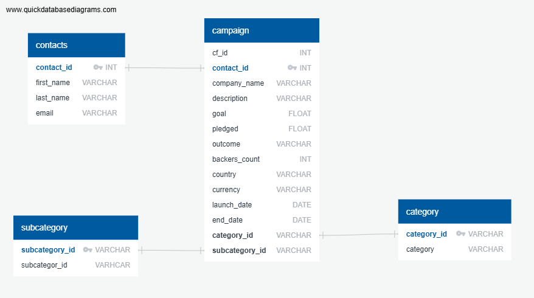

# Crowdfunding_ETL

Data Analytics Course Project 2

# Task
For this project, we will work as a team to extract and transform data sets into DataFrames and CSV files before loading them into a database. The dataset we are building an ETL pipeline for is a Crowdfunding dataset. Our resources include two Excel files: crowdfunding.xlsx and contacts.xlsx. The first contains extensive data about different Crowdfunding projects while the second contains basic contact information for each project. 

# Methodology
We will use Python, Pandas, and Python dictionary methods to extract and transform the data. Next, we'll create four CSV files and use the CSV file data to create and ERD and a table schema. Finally, we'll upload the CSV data into a Postgres database.

## Extraction and Transformation
Dataframe 1: Category - Using the Crowdfunding.xlsx, we extracted the **category** and **category_ID** to create this DataFrame.

Dataframe 2: Subcategory - Also using the crowdunding.xlsx, we extracted the **subcategory** and **subcategory_id** for each Crowdfunding project.

Dataframe 3: Campaign - This is the final DataFrame to be created from the crowdfunding.xlsx and extracted all of the original columns from the Excel file. We transformed this data by ranmaing columns, changing datatypes, and converting the UTC times to datetime format. We also merged this dataframe with the category_df and the subcategory_df to extract the category and subcategory id numbers for each project.

Dataframe 4: Contacts - This DataFrame extracted data from the contact.xlsx file. However, it required considerable transformation because all data was loaded into one column. We used Pandas to iterate through each row to extract keys and values for the columns and rows. Our new DataFrame went from a single contacts column to four: contact_id, last_name, first_name, email.

Each dataframe was exported as a CSV file.
 
## Loading

Using our four CSV files, we sketched an ERD of the tables using QuickDBD:

From that ERD, we created a table schema for each CSV file and saved it as a Postgres file which we then uploaded into a new database called crowdfunding_db. We then uploaded the CSV files into their corresponding SQL tables. 
